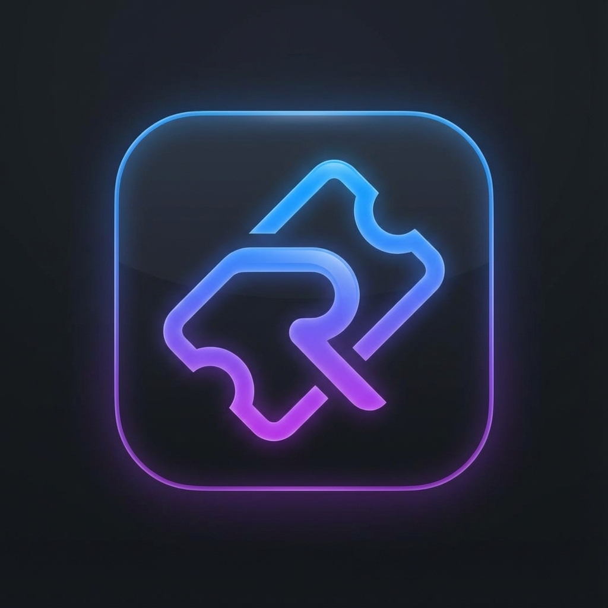
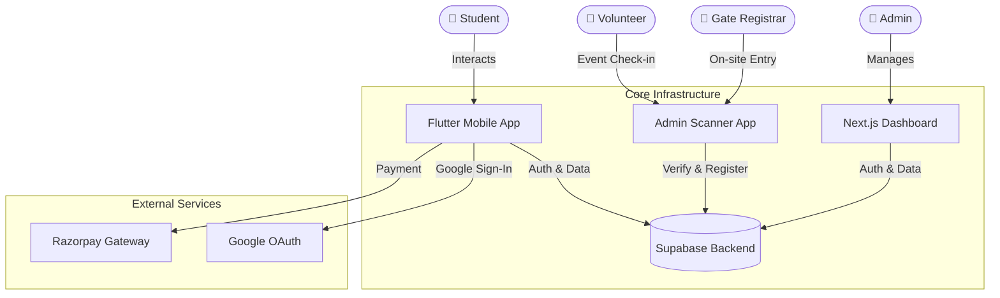

<div align="center">

# ⚡ **R E G I S T E R - Y U** ⚡

**The Ultimate Campus Event Orchestration Layer**

[](https://github.com/AdithyaKul/RegisterYu)
[](https://github.com/AdithyaKul/RegisterYu/releases)
[](https://flutter.dev)
[](https://nextjs.org)
[](https://supabase.com)
[](https://tailwindcss.com)
[](https://www.typescriptlang.org/)



**[ 📲 DOWNLOAD APP (v1.0.5) ](https://registeryu-dashboard.vercel.app/app-registeryu.apk)** • **[ 🌐 OPEN DASHBOARD ](https://registeryu-dashboard.vercel.app)**

</div>

---

## 🔮 **THE VISION**

**RegisterYu** dismantles the archaic, paper-based chaos of college fests. We replaced it with a **liquid-smooth, digital nervous system** that connects students, organizers, and events in real-time. 

Built with **Liquid Glass Aesthetics** and **Native Performance Optimization**, the interface feels premium and responsive.

---

## 🏗️ **SYSTEM ARCHITECTURE**

We don't do spaghetti code. We build skyscrapers.



---

## 💎 **CORE FEATURES**

### 1️⃣ **The Mobile Experience** (Flutter v1.0.5)
> *For the students. Fast, fluid, fabulous.*
*   **Optimized Scrolling**: Native ClampingScrollPhysics for buttery-smooth performance
*   **Smart Wallet**: QR-based digital tickets for events
*   **Google One-Tap**: Instant login with Google OAuth
*   **Profile Management**: Complete student profile with USN, semester, department
*   **Event Discovery**: Browse and register for campus events
*   **Payment Integration**: Razorpay gateway for paid events

### 2️⃣ **The Command Center** (Next.js 15)
> *For the Admins. Total Control.*
*   **Event Management**: Create, edit, and manage all events
*   **Registration Tracking**: View all registrations in real-time
*   **User Management**: Admin dashboard with RBAC
*   **Analytics Dashboard**: Track event metrics and revenue

### 3️⃣ **The Gate Keepers** (Scanner App - In Development)
> *For the Frontline. Entry & On-spot.*
*   **QR Ticket Scanning**: Verify student tickets instantly
*   **Check-in Management**: Track event attendance
*   **Offline Mode**: Works without internet (sync later)

---

## 📂 **PROJECT STRUCTURE**

```text
📦 RegisterYu
 ┣ 📂 mobile_app         # Flutter Mobile App (v1.0.5)
 ┃ ┣ 📂 lib              # Core Logic & UI Components
 ┃ ┃ ┣ 📂 features       # Feature-based architecture
 ┃ ┃ ┣ 📂 core           # Services, models, theme
 ┃ ┃ ┗ 📂 shared         # Reusable widgets
 ┃ ┗ 📜 pubspec.yaml     # Dependencies
 ┣ 📂 web-dashboard      # Next.js Admin Dashboard
 ┃ ┣ 📂 src              # React Components & Pages
 ┃ ┗ 📂 public           # Assets & APK Hosting
 ┣ 📂 admin_app          # Flutter Scanner App (WIP)
 ┣ 📂 backend            # Supabase Configs & SQL Migrations
 ┗ 📜 README.md          # You are here
```

---

## 🚀 **QUICK START**

### **Prerequisites**
*   **Flutter SDK**: ≥ 3.27.0
*   **Node.js**: ≥ 20.0.0
*   **Supabase Account**: For backend services
*   **Git**: Latest version

### **Setup Instructions**

**1. Clone the Repository**
```bash
git clone https://github.com/AdithyaKul/RegisterYu.git
cd RegisterYu
```

**2. Setup Supabase Backend**
```bash
# Run SQL migrations in your Supabase project
# Files located in: backend/migrations/
# 1. Run: 01_initial_schema.sql
# 2. Run: 20260111_add_student_details.sql
```

**3. Configure Environment**
```bash
# Mobile App: Create lib/core/config/supabase_config.dart
# Add your Supabase URL and anon key

# Web Dashboard: Create .env.local
# Add Supabase credentials
```

**4. Run Mobile App**
```bash
cd mobile_app
flutter pub get
flutter run --release
```

**5. Run Web Dashboard**
```bash
cd web-dashboard
npm install
npm run dev
```

---

## ⚡ **PERFORMANCE OPTIMIZATIONS**

### **Mobile App (v1.0.5 Updates)**
*   **Native Scroll Physics**: Removed custom physics, using platform-native `ClampingScrollPhysics`
*   **Background Animation Removed**: Eliminated `LiquidBackground` for better scroll performance
*   **Optimized Cache**: Reduced `cacheExtent` to 500px for faster initial rendering
*   **No Bounce Scrolling**: Android-native clamping behavior (no infinite scroll)
*   **Image Caching**: Using `CachedNetworkImage` for efficient image loading
*   **Minimal Rebuilds**: `RepaintBoundary` and proper `Key` usage

---

## 📋 **RELEASE NOTES**

### **v1.0.5** (Latest) - Performance & UX Update
- ✅ Fixed infinite scroll/bounce issues
- ✅ Removed background animations for better performance
- ✅ Native Android scroll physics
- ✅ Profile save functionality working
- ✅ Optimized rendering with reduced cache

### **Previous Versions**
See [CHANGELOG.md](./CHANGELOG.md) for full version history.

---

## 📜 **DOCUMENTATION**

*   **[Setup Google Auth](./GOOGLE_AUTH_SETUP.md)**: Configure Google Sign-In
*   **[Known Issues](./KNOWN_ISSUES.md)**: Current limitations and workarounds
*   **[Implementation Plan](./IMPLEMENTATION_PLAN.md)**: Detailed architecture
*   **[Changelog](./CHANGELOG.md)**: Version history
*   **[Supabase Setup](./mobile_app/SUPABASE_CONFIG.md)**: Backend configuration

---

## 🔮 **ROADMAP**

- [ ] **Certificate Generator**: Automated PDF certificates for participants
- [ ] **NFC Check-in**: Tap-to-verify entry system  
- [ ] **Push Notifications**: Event reminders and updates
- [ ] **Analytics Dashboard**: Advanced metrics for admins
- [ ] **Offline Mode**: Full offline support with sync

---

## 🤝 **CONTRIBUTING**

We welcome contributions! Please:
1. Fork the repository
2. Create a feature branch
3. Commit your changes
4. Push to your fork
5. Submit a Pull Request

---

<div align="center">

### **Crafted with ❤️ and ☕ at Sambhram Institute of Technology**

*"Building the future of campus events."*

**Current Version: v1.0.5** | **Build: STABLE** | **Status: PRODUCTION READY**

</div>
