<div align="center">

# ⚡ **R E G I S T E R - Y U** ⚡

**The Ultimate Campus Event Orchestration Layer**

[](https://github.com/AdithyaKul/RegisterYu)
[](https://github.com/AdithyaKul/RegisterYu/releases)
[](https://nextjs.org)


**[ 📲 DOWNLOAD APP (BETA) ](https://registeryu-dashboard.vercel.app/app-registeryu.apk)** • **[ 🌐 OPEN DASHBOARD ](https://registeryu-dashboard.vercel.app)**

</div>

---

## 🔮 **THE VISION**

**RegisterYu** dismantles the archaic, paper-based chaos of college fests. We replaced it with a **liquid-smooth, digital nervous system** that connects students, organizers, and events in real-time. 

Built with **Liquid Glass Aesthetics**, the interface feels like it's floating. It's not just an app; it's a statement.

---

## 🏗️ **SYSTEM ARCHITECTURE**

We don't do spaghetti code. We build skyscrapers.

```mermaid
graph TD
    User([📱 Student]) -->|Interacts| MobileApp[Flutter Mobile App]
    Admin([🤵 Organizer]) -->|Manages| WebDash[Next.js Dashboard]
    Security([👮 Guard]) -->|Scans| Scanner[Admin Scanner App]

    subgraph "Core Infrastructure"
        MobileApp -->|Auth & Data| Supabase[(Supabase Backend)]
        WebDash -->|Auth & Data| Supabase
        Scanner -->|Verify Ticket| Supabase
    end

    subgraph "External Services"
        MobileApp -->|Google Sign-In| OAuth[Google OAuth]
        MobileApp -->|Payments| Razorpay[Razorpay Gateway]
    end
```



---

## 💎 **THE TRINITY**

### 1️⃣ **The Mobile Experience** (Flutter)
> *For the students. Fast, fluid, fabulous.*
*   **120Hz Rendering**: Optimized scroll physics that feel sharper than reality.
*   **Smart Wallet**: NFC-ready digital tickets.
*   **Guest Mode**: Try before you buy.
*   **Google One-Tap**: Because passwords are so 2010.

### 2️⃣ **The Command Center** (Next.js 15)
> *For the masterminds. Control everything.*
*   **Live Analytics**: Watch registration numbers climb in real-time.
*   **Revenue Tracking**: Every rupee accounted for.
*   **RBAC System**: Granular permission control for your team.

### 3️⃣ **The Gatekeeper** (Admin Scanner)
> *For the ground crew. Speed is key.*
*   **Sub-second Scanning**: Process queues instantly.
*   **Offline Fallback**: Works even when the network chokes.

---

## 📂 **PROJECT STRUCTURE**

```text
📦 RegisterYu
 ┣ 📂 mobile_app         # The Flutter Application (User Facing)
 ┃ ┣ 📂 lib              # Core Logic & UI Components
 ┃ ┗ 📜 pubspec.yaml     # Dependencies
 ┣ 📂 web-dashboard      # The Next.js Admin Panel
 ┃ ┣ 📂 src              # React Components & Pages
 ┃ ┗ 📂 public           # Assets & APK Hosting
 ┣ 📂 admin_app          # The Ticket Scanner Tool
 ┣ 📂 backend            # Supabase Configs & SQL
 ┗ 📜 README.md          # You are here
```

---

## 🚀 **DEPLOYMENT PROTOCOL**

### **Prerequisites**
*   **Flutter SDK**: > 3.27.0
*   **Node.js**: > 20.0.0
*   **Git**: Latest

### **Initiate Sequence**

**1. Clone the Monorepo**
```bash
git clone https://github.com/AdithyaKul/RegisterYu.git
```

**2. Ignite Mobile App**
```bash
cd mobile_app
flutter pub get
flutter run --release
```

**3. Launch Web Dashboard**
```bash
cd web-dashboard
npm install
npm run dev
```

---

## 📜 **DOCUMENTATION**

*   **[Setup Google Auth](./GOOGLE_AUTH_SETUP.md)**: The key to social login.
*   **[Known Issues](./KNOWN_ISSUES.md)**: We know, we're working on it.
*   **[The Master Plan](./IMPLEMENTATION_PLAN.md)**: Future roadmap.
*   **[Changelog](./CHANGELOG.md)**: Version history.

---

<div align="center">

### **Forged with 🩸, 😓 & ☕ at Sambhram Institute of Technology**

*"We code to corrupt the status quo."*

</div>
